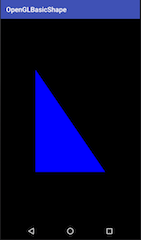
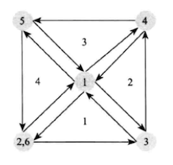
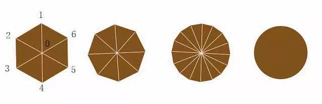
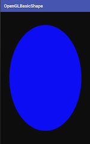
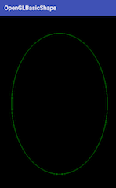
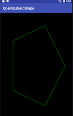
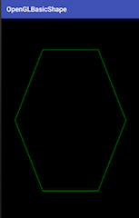
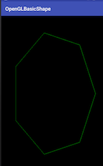

在之前的一篇博客中，讲述了 OpenGL 绘制一个点的流程及相关的代码，其中关于 OpenGL 程序编译部分都是可以在其他项目中接着复用的，接下来会讲到如何去绘制其他的基本图元。

<!--more-->

## 绘制直线

两点确定一条直线，显然绘制一条直线是需要两个顶点数据的。

定义如下顶点数据，绘制一条屏幕对角线的直线：

``` java
    float[] lineVertex = {
            -0.5f, 0.5f,
            0.5f, -0.5f
    };
```

而我们的顶点着色器和片段着色器也会发生一些变化，最终还是绘制一条单一颜色的直线。

顶点着色器代码：
``` java
attribute vec4 a_Position;
void main(){
    gl_Position = a_Position;
}
```

由于是绘制的直线，相比于绘制点，就没有了 `gl_PointSize`变量来确定大小了。

片段着色器代码：

``` java
precision mediump float;
uniform vec4 u_Color;
void main()
{
    gl_FragColor = u_Color;
}
```

依旧是纯色，目前还没有涉及到颜色的变化。

而在我们给着色器变量绑定数据时，依旧是通过`glGetUniformLocation`和`glGetAttribLocation`方法给`uniform`和`attribute`类型的`u_Color`和`a_Position`变量赋值。

最后还是通过`glDrawArrays`方法执行绘制。

``` java
glDrawArrays(GL_LINES, 0, 2);
```

`GL_LINES`代表绘制的类型是直线，而`0，2`则是绘制的顶点范围。

## 绘制三角形

绘制三角形和绘制直线基本差不多，从两个点的直线变成了三个点的三角形。

顶点数据也发生了相应的改动，假设如下的数据，注意要以逆时针定义数据。
 
``` java
    float[] triangleVertex = {
            -0.5f, 0.5f,
            -0.5f, -0.5f,
            0.5f, -0.5f
    };
```

那么最后绘制时，绘制类型也会发生变化了，顶点个数范围也会变化。

``` java
 glDrawArrays(GL_TRIANGLES, 0, 3);
```

绘制三角形结果如图：




## 绘制矩形

显然，OpenGL 是没有提供矩形这一基本图元的，但是我们可以用两个三角形来拼接成一个矩形。

OpenGL 中提供了一个绘制类型叫做`三角形扇`，如下图所示：



在上图中，矩形的每一条边上的顶点都被两个三角形使用了，而且中心的顶点被所有四个三角形使用了。

我们不必输入四个三角形的顶点数据来绘制四个三角形从而组成矩形，可以告诉 OpenGL 重用那些顶点数据，把这些顶点作为一个三角形扇绘制。

一个三角形扇以一个中心顶点作为起始，使用相邻的两个顶点创建第一个三角形，接下来的每个顶点都会创建一个三角形，围绕起始的中心点按扇形展开，为了使扇形闭合，我们需要在最后重复第二个点。

所以，以三角形扇的形式绘制一个矩形，我们可以重新定义矩形的顶点数据：

``` java
   float[] rectangleVertex = {
		   // 第一个点就是三角形扇的中心点
            0f,    0f, 
            -0.5f, -0.8f,   
            0.5f, -0.8f,   
            0.5f,  0.8f,   
            -0.5f,  0.8f,   
            -0.5f, -0.8f
          // 重复第二个点，使三角形扇闭合
    };
```

而着色器代码依旧不变，绘制一个纯色的矩形，绘制代码如下：

``` java
  glDrawArrays(GL_TRIANGLE_FAN, 0, 6);
```

绘制类型为`GL_TRIANGLE_FAN`，顶点数量也变成了 6 个。

那么问题来了，OpenGL 到底为我们提供哪些绘制方式呢？如下表所示：

|绘制类型|绘制方式|
|---|----|
|GL_POINTS|将传入的顶点坐标作为单独的点绘制|
|GL_LINES|将传入的坐标作为单独线条绘制，ABCDEFG六个顶点，绘制AB、CD、EF三条线|
|GL_LINE_STRIP|将传入的顶点作为折线绘制，ABCD四个顶点，绘制AB、BC、CD三条线|
|GL_LINE_LOOP|将传入的顶点作为闭合折线绘制，ABCD四个顶点，绘制AB、BC、CD、DA四条线。|
|GL_TRIANGLES|将传入的顶点作为单独的三角形绘制，ABCDEF绘制ABC,DEF两个三角形|
|GL_TRIANGLE_STRIP|将传入的顶点作为三角条带绘制，ABCDEF绘制ABC,BCD,CDE,DEF四个三角形|
|GL_TRIANGLE_FAN|将传入的顶点作为扇面绘制，ABCDEF绘制ABC、ACD、ADE、AEF四个三角形|

## 绘制圆形

现在我们要绘制一个圆形，显然 OpenGL 是没有提供圆形的绘制类型的，这就要用到上面提供的绘制方式了。

以绘制一个实心的圆形为例子：

有了上面`三角形扇绘`制矩形的例子，我们按照同样的思想，把一个圆形分成多个三角形组成，如下图所示：




我们分的三角形越多，三角形个数趋向于无限大的时候，整个图案也就越趋向于圆。

这样一来，顶点数据就不能再靠手写了。

``` java
    // 圆形分割的数量，分成 360 份，可由 360 个线段组成空心圆，也可以由 360 个三角形组成实心圆
    public static final int VERTEX_DATA_NUM = 360;
    // 360 个顶点的位置，因为有 x 和 y 坐标，所以 double 一下，再加上中心点 和 闭合的点
    float[] circleVertex = new float[VERTEX_DATA_NUM * 2 + 4];
    // 分成 360 份，每一份的弧度
    float radian = (float) (2 * Math.PI / VERTEX_DATA_NUM);
    // 绘制的半径
    float radius = 0.8f;
    
    // 初始化圆形的顶点数据
    private void initVertexData() {
        // 中心点
        circleVertex[0] = 0f;
        circleVertex[1] = 0f;
        // 圆的 360 份的顶点数据
        for (int i = 0; i < VERTEX_DATA_NUM; i++) {
            circleVertex[2 * i + 2] = (float) (radius * Math.cos(radian * i));
            circleVertex[2 * i + 1 + 2] = (float) (radius * Math.sin(radian * i));
        }
        // 闭合点
        circleVertex[VERTEX_DATA_NUM * 2 + 2] = (float) (radius * Math.cos(radian));
        circleVertex[VERTEX_DATA_NUM * 2 + 3] = (float) (radius * Math.sin(radian));
    }
```

把圆分成了 360 份。圆形的顶点数据也分为了三部分了，以原心作为我们的中心点，中间的 360 个点用来绘制三角形，最后一个点使得我们的图形闭合。

在绘制时依旧使用三角形扇的形式来绘制。

``` java
	// 要把顶点数据个数对应上
    glDrawArrays(GL_TRIANGLE_FAN, 0, VERTEX_DATA_NUM + 2);
```

当然，在绘制圆形时，我们也可以不单独定义原点和闭合点，直接使用圆形的 360 个顶点来绘制，最终的结果依旧会是一个圆形。



当然，我们也可以使用其他的绘制类型，比如直线，来绘制一个空心的圆形。

还是上面定义的顶点数据，但是我们只用其中分割成 360 份的那部分顶点数据就好了，也就是去掉首位两个点，然后把这个 360 个点依次连接绘制成圆形。

``` java
        glDrawArrays(GL_LINE_LOOP, 1, VERTEX_DATA_NUM );
```




这样就完成一个圆形的绘制。


## 正多边形的绘制

在绘制圆形的基础上，我们还可以进行拓展一下。

要知道，最后我们的圆形实际上是一个正多边形来趋近于圆形的，只是肉眼难以观察到了，毕竟它是一个正三百六十边形...

那么假设我们要绘制正五边形、正六边形、正七边形呢？

实际上也很简单，只要把圆分成五份、六份、七份就好了。

展示一些绘制图如下：


正五边形：



正六边形：



正七边形：




## 小结

到此，基本讲述了 OpenGL 的绘制流程以及基本图形的绘制。

根据图形和绘制类型来采用以何种方式进行绘制，以及定义顶点数据，最后直接绘制对应图形即可。

但显然，这还是不够的，还是有很多问题的。

想要绘制一个圆形，结果却成了椭圆；想要绘制一个正五边形，却成了歪的；这到底是道德的沦丧还是人性的泯灭，一切的揭晓就在下一篇博客中了。


具体代码详情，可以参考我的 Github 项目：
https://github.com/glumes/AndroidOpenGLTutorial


## 参考
1、http://blog.csdn.net/junzia/article/details/52818488