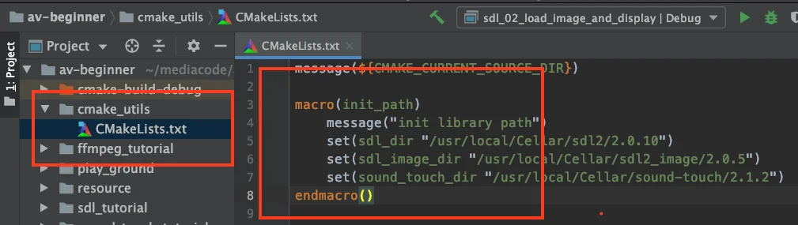
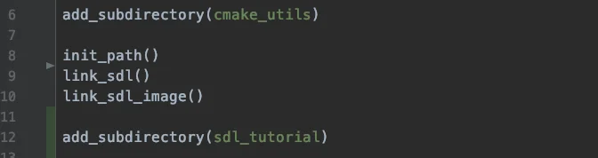
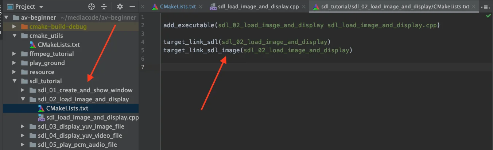
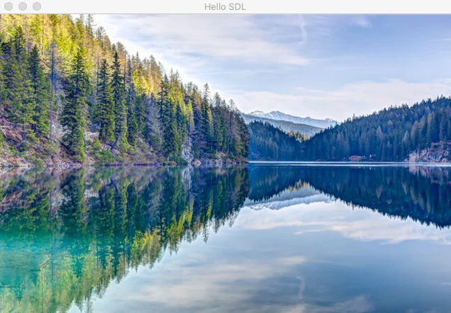

在前面的文章中已经介绍完 SDL 显示窗口、消息循环和事件响应这些基础内容，有了这些基础就可以进行功能性开发了。

本篇的主要内容是利用 SDL 加载并显示一张图片，然后再去进行更多的音视频操作。

<!--more-->

### SDL2_Image 配置

之前写过两篇 libpng 和 libjpeg-turbo 编译与实践的文章：

* [图像库 libpng 编译与实践](https://mp.weixin.qq.com/s/rVhm5BD2cPR9h7rsW0xiQA)
* [图像库 libjpeg-turbo 编译与实践](https://mp.weixin.qq.com/s/x-dTLowXcqysnLxZ0BGA2g)

有需要的可以去翻阅一下。

在 SDL 中加载 png 或者 jpeg 图片用不到上面两个库了，需要用到 SDL 特定的图片库 SDL_Image ，执行以下命令去下载：

```cpp
brew install sdl2_image
```

我用的版本是 `2.0.5` ，也是目前最新的版本，之后我们要在 CMake 中去配置它。

### CMake 工程配置

对 `av-beginner` 项目的 CMake 配置做了一些改动，创建了一个 `cmake_utils` 的目录，在该目录下创建了一个 `CMakeLists.txt` ，里面存放一些自定义的函数，专门用来做开源库的链接加载工作，如下图红框内容所示：




定义了一个 `init_path` 的宏，宏的功能和函数是有些类似的，在里面定义了不同开源库的路径变量，后续只要引用这些变量就好了。如果你的电脑上路径不同，修改这里的宏定义就行。

> 如果对 CMake 的操作不熟悉的话，建议阅读之前写过的文章，涵盖了很多基础操作。
> [Android NDK 开发之 CMake 必知必会](https://mp.weixin.qq.com/s/7pBjoVGDl_zGDwWWBOhkmg)


当下载了 SDL_Image 之后，找到它的路径，把它的库加载到 CMake 链接目录中来，也就是要调用 `link_directories` 方法，这里同样可以定义一个宏：

```cpp
macro(link_sdl_image)
    message("link sdl image library and path is ${sdl_image_dir}")
    include_directories(${sdl_image_dir}/include/SDL2)
    link_directories(${sdl_image_dir}/lib)
endmacro()
```

之后就需要把目标执行文件或者目标库与 SDL_Image 开源库关联起来，也就是 `target_link_libraries` 方法，同样定义一个宏：

```cpp
macro(target_link_sdl_image name)
    message("${name} link sdl image")
    target_link_libraries(${name}
            SDL2_image
            )
endmacro()
```

这个宏有个参数 `name` ，它就是要链接的目标文件 target 。

> 对于 SDL 库或者其他库，也可以创建类似的宏，具体在源码中能看到。


在完成了 SDL_Image 的 CMake 配置之后，就需要在工程的主 `CMakeLists.txt` 文件中把它包含进去，现在还只是在 `cmake_utils` 目录中，这样是引用不到宏的。

通过 `add_subdirectory` 方法将定义的功能添加进来，接下来就可以使用了。




同时，对于 SDL 项目代码，单独创建一个文件夹去存放，再根据每个小项又划分文件夹：




如上图所示，针对每个小项又有单独的 `CMakeLists.txt` 配置文件，在里面按需执行动态库的关联就好了。

经过以上的工程配置整改，对于后续的开发模块划分是很有帮助的，不仅便于添加各种开源库，更利于去单个编译项目。

后续添加的库都会按照这个模式进行添加。


### SDL_Image 加载 图片并显示

完成了配置之后，就可以进行 SDL_Image 的开发了，整个开发流程比较简单。

前面的文章中我们创建并展示了 `SDL_Window`，SDL_Window 内有一个叫做 `SDL_Surface` 的结构，实际上它才是最终渲染展示的。

我们加载一张图片，并将图片转换成 `SDL_Surface` ，然后把图片对应的 SDL_Surface 转换到 SDL_Window 对应的 SDL_Surface ，再更新一下 SDL_Window 的 SDL_Surface 内容，渲染到屏幕就好了。

核心代码如下所示：

```cpp
    // 得到 SDL_Window 的 SDL_Surface
    SDL_Surface *pWindowSurface = SDL_GetWindowSurface(pWindow);
    // 根据图片创建一个 SDL_Surface
    SDL_Surface *pImageSurface = IMG_Load(image_path.c_str());
    bool bQuit = false;
    SDL_Event windowEvent;
    while (!bQuit){
        while (SDL_PollEvent(&windowEvent)){
            switch (windowEvent.type){
                case SDL_QUIT:
                    bQuit = true;
                    break;
                default:
                    break;
            }
        }
        // 将 pImageSurface 的内容传输到 上
        SDL_BlitSurface(pImageSurface, nullptr,pWindowSurface,nullptr);
        // 上屏操作，将 Surface 内容显示到屏幕上
        SDL_UpdateWindowSurface(pWindow);
    }
```

最终结果如下：




### 总结

以上就是音视频基础学习连载的 `004` 篇。

完成了 SDL 加载图片并显示的流程，整体代码比较简单，很多东西都是之前文章提到过的，反而重点更侧重于工程的 CMake 配置，有兴趣的可以看看代码。

具体代码见仓库：

> https://github.com/glumes/av-beginner

本篇文章对应的提交 `tag` 为 `av-beginner-004`，可切换至对应源码查看。

能力有限，文中有不对之处，欢迎加我微信 ezglumes 进行交流~~